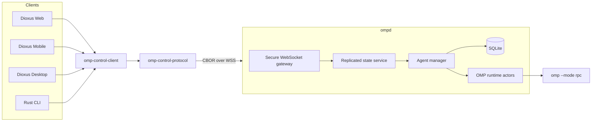

## Revised decisions

Replace the HTTP/REST control API from the original plan with:

- **One persistent WebSocket connection**
- **Binary CBOR messages**
- **Shared Rust protocol types**
- **Snapshot + typed delta state synchronization**
- **TLS for every non-development connection**
- **One-time out-of-band pairing secrets that mint per-device credentials**

WebSocket is the best initial transport because it works across Dioxus web, mobile, and desktop. A custom TCP or QUIC protocol would exclude browser-hosted Dioxus clients; WebTransport is a possible future adapter but has a less mature deployment and client ecosystem.

Dioxus 0.7 directly supports typed WebSockets and `CborEncoding`, including reactive connection wrappers. This matches the proposed design closely.



---

# Revised crate boundaries

| Crate | Responsibility |
|---|---|
| `omp-rpc` | OMP JSONL wire types, protocol-v2 frame decoding |
| `omp-runtime` | Own and supervise one `omp --mode rpc` process |
| `omp-control-protocol` | Stable shared client/daemon types and CBOR encoding |
| `omp-control-plane` | Agent registry, runs, state revisions, subscriptions, interaction leases |
| `omp-control-client` | Transport-independent Rust client, reconnection, state reducer |
| `ompd` | TLS, WebSocket sessions, authentication, persistence, process orchestration |
| Future Dioxus app crate | UI and Dioxus hooks/signals over `omp-control-client` |

`omp-control-protocol` should depend on `omp-rpc` so clients can directly consume useful types such as messages, session events, models, todos, and usage data.

It should **not** depend on Dioxus, Tokio, Axum, database types, or daemon internals. That keeps it usable by the CLI, mobile, desktop, web/WASM, and non-Dioxus Rust clients.

---

# Protocol transport

## WebSocket + CBOR

Use a single endpoint:

```text
wss://host.example/control
```

The WebSocket HTTP upgrade is only transport setup. All control-plane operations, subscriptions, responses, and state synchronization use the binary protocol; there is no REST control surface.

The daemon may separately serve:

- Static Dioxus web assets.
- A minimal health endpoint.
- A web pairing landing page.

Those are not part of the agent control protocol.

## Why CBOR

Use CBOR rather than JSON, bincode, postcard, or raw Rust memory layouts.

Benefits:

- Serde structs and enums.
- Byte strings without base64 expansion.
- Self-describing values.
- Map-based fields that support optional additions.
- Shared implementation between daemon and Rust clients.
- Dioxus provides a built-in `CborEncoding`.

Avoid bincode/postcard for the network protocol. They are compact but much more brittle when fields or enum variants evolve. Avoid `rkyv` because the control protocol needs explicit validation and stable versioning rather than in-memory layout coupling.

## Stable wire types

“Shared Rust types” should mean shared protocol DTOs, not serializing arbitrary internal structures.

Protocol types should:

- Use explicit Serde tags and names.
- Use fixed-width integers, never `usize`.
- Represent timestamps as documented UTC milliseconds.
- Represent durations as explicit millisecond newtypes.
- Represent paths as UTF-8 wire strings, not `PathBuf`.
- Avoid architecture-dependent or platform-specific types.
- Keep map fields deterministic where useful.
- Carry an explicit protocol version.
- Use capability negotiation for additive features.
- Increment the protocol major version for incompatible enum/schema changes.

Maintain fixed CBOR compatibility vectors so encoder changes cannot silently alter the wire contract.

---

# Top-level protocol

Conceptually:

```rust
pub enum ClientFrame {
    Hello(ClientHello),
    Request(RequestEnvelope),
    Subscribe(SubscribeRequest),
    Unsubscribe(UnsubscribeRequest),
    UiResponse(UiResponse),
    Ping(Ping),
}

pub enum ServerFrame {
    Welcome(ServerWelcome),
    Response(ResponseEnvelope),
    Snapshot(StateSnapshot),
    Delta(StateDelta),
    Event(EventEnvelope),
    ReplayGap(ReplayGap),
    InteractionRequest(InteractionRequest),
    Error(ProtocolError),
    Pong(Pong),
    ServerShutdown(ServerShutdown),
}
```

Every WebSocket binary message contains exactly one CBOR-encoded frame.

Apply explicit pre-auth and post-auth frame-size limits. Large histories should continue using pagination rather than oversized state snapshots.

---

# Connection and authentication handshake

## Initial connection

The client opens a TLS-protected WebSocket and immediately sends:

```rust

pub struct ClientHello {
    pub supported_versions: Vec<ProtocolVersion>,
    pub client: ClientDescriptor,
    pub authentication: ClientAuthentication,
    pub resume: ResumeState,
}
```

Authentication variants:

```rust
pub enum ClientAuthentication {
    Pair {
        pairing_id: PairingId,
        secret: PairingSecret,
        device: DeviceDescriptor,
    },
    Device {
        device_id: DeviceId,
        token: DeviceToken,
    },
}
```

The server replies only after authentication succeeds:

```rust
pub struct ServerWelcome {
    pub protocol_version: ProtocolVersion,
    pub server_id: ServerId,
    pub connection_id: ConnectionId,
    pub device_id: DeviceId,
    pub capabilities: ServerCapabilities,
    pub heartbeat_interval_ms: u64,
}
```

No snapshots, events, error details, or agent metadata should be sent before successful authentication.

Because browser WebSocket APIs do not consistently allow custom authorization headers, authentication belongs in the first binary protocol frame. Do not place bearer secrets in:

- Query strings.
- Request paths.
- WebSocket subprotocol names.
- Ordinary server logs.

Unauthenticated sockets should have a short handshake deadline, a very small message limit, and rate-limited failures.

---

# Pairing and device credentials

## One-time pairing secret

The daemon should not use one permanent shared secret across every device. Instead:

1. The daemon generates a cryptographically random, 256-bit pairing secret.
2. It stores only a hash of the secret.
3. It gives the secret a short expiry and single-use semantics.
4. The secret is communicated out of band through a link or QR code.
5. Successful pairing consumes the secret.
6. The daemon issues a separate long-lived device credential.
7. Each device can later be listed, scoped, rotated, or revoked independently.

Random 256-bit secrets do not need password hashing. A secure hash plus constant-time comparison is sufficient because brute force is infeasible. Database and log handling must still treat their hashes as sensitive authentication records.

## Pairing command

Provide a local administrative command:

```text
ompd pair --name "Kevin's iPhone" --expires 10m
```

It should output:

- A terminal QR code.
- A copyable native-app link.
- Optionally a browser pairing link.
- The expiry and requested permission set.

The operation should be available only through a local administrative channel, such as a Unix socket on Unix and a named pipe on Windows. Do not expose unauthenticated pairing-secret generation over the network.

## Pairing bundle

```rust
pub struct PairingBundle {
    pub format_version: u16,
    pub server_id: ServerId,
    pub endpoint: String,
    pub pairing_id: PairingId,
    pub secret: PairingSecret,
    pub expires_at_ms: u64,
    pub tls_identity: TlsIdentityHint,
}
```

Encode the bundle as CBOR, then base64url for links and QR codes.

Possible links:

```text

omp-remote://pair#<base64url-payload>
```

For the web app:

```text
https://host.example/pair#<base64url-payload>
```

Use the URL fragment, not a query parameter. Browser fragments are not included in the HTTP request, reverse-proxy access logs, or referrer sent to the server. The Dioxus application reads the fragment and performs pairing through the encrypted WebSocket.

## Issued device credential

After pairing:

```rust
pub struct DeviceCredential {
    pub server_id: ServerId,
    pub device_id: DeviceId,
    pub token: DeviceToken,
    pub scopes: DeviceScopes,
}
```

Storage:

- iOS: Keychain.
- Android: Keystore-backed secure storage.
- Desktop: OS keyring.
- Web: browser storage, with a strict CSP and no third-party scripts.

A web bearer credential remains exposed to successful same-origin script injection, so the web frontend must be treated as part of the security boundary.

## Initial scopes

Even if the first pairing receives every scope, model permissions explicitly:

```rust
pub struct DeviceScopes {
    pub observe: bool,
    pub prompt: bool,
    pub mutate_session: bool,
    pub stop_agent: bool,
    pub answer_ui: bool,
    pub administer_devices: bool,
}
```

This avoids a protocol redesign when read-only or limited clients are introduced.

---

# Encryption and Tailscale

## Always use TLS

Tailscale already provides WireGuard encryption between tailnet devices, but the daemon should still use TLS:

- Browser clients require a trusted secure origin for many APIs.
- The service may eventually leave the tailnet.
- TLS provides an application-level server identity.
- The application has one security model inside and outside Tailscale.
- Pairing secrets are never sent over a plaintext application connection.

Use TLS 1.3 through `rustls`. Do not design custom application-layer encryption.

## Tailnet deployment

Preferred tailnet address:

```text
wss://omp-host.<tailnet-name>.ts.net/control
```

Tailscale can provision publicly trusted certificates for full MagicDNS names through `tailscale cert`. The certificate still needs renewal management; a Caddy/Tailscale integration or another trusted reverse proxy may be simpler than having `ompd` shell out to Tailscale.

Important deployment detail: the machine and tailnet DNS names in issued certificates appear in Certificate Transparency logs. Avoid sensitive machine names.

Supported TLS modes should be:

```rust
pub enum TlsMode {
    CertificateFiles {
        certificate: PathBuf,
        private_key: PathBuf,
    },
    TrustedReverseProxy {
        local_endpoint: LocalEndpoint,
    },
    PinnedSelfSigned {
        certificate: PathBuf,
        private_key: PathBuf,
    },
}
```

Rules:

- `CertificateFiles`: normal direct `rustls` listener.
- `TrustedReverseProxy`: daemon listens only on loopback, Unix socket, or named pipe.
- `PinnedSelfSigned`: native mobile/desktop clients only; certificate fingerprint is included in the pairing bundle.
- Browser clients require a browser-trusted certificate. JavaScript cannot implement safe custom certificate pinning for a self-signed WebSocket endpoint.

Outside Tailscale, use a normal trusted certificate through ACME or a reverse proxy. Device authentication remains required regardless of network location.

---

# Better state synchronization

The protocol should expose replicated control-plane state rather than requiring every Dioxus component to interpret raw OMP events.

Use two independent cursors:

```rust
pub struct StateRevision(pub u64);
pub struct EventSequence(pub u64);
```

- **State revision**: changes when the authoritative control state changes.
- **Event sequence**: advances for each streamed event, including high-volume OMP deltas.

This lets the UI recover correct state even if it intentionally drops old token-streaming events.

## Authoritative snapshot

```rust
pub struct AgentSnapshot {
    pub agent_id: AgentId,
    pub revision: StateRevision,
    pub event_sequence: EventSequence,
    pub lifecycle: AgentLifecycle,
    pub session: Option<SessionSummary>,
    pub active_run: Option<RunSnapshot>,
    pub recent_runs: Vec<RunSnapshot>,
    pub interaction: InteractionState,
    pub available_commands: Vec<AvailableSlashCommand>,
}
```

## Typed deltas

```rust
pub struct StateDelta {
    pub agent_id: AgentId,
    pub base_revision: StateRevision,
    pub revision: StateRevision,
    pub change: AgentStateChange,
}

pub enum AgentStateChange {
    LifecycleChanged(AgentLifecycle),
    SessionChanged(SessionSummary),
    RunUpserted(RunSnapshot),
    RunRemoved(RunId),
    InteractionChanged(InteractionState),
    AvailableCommandsChanged(Vec<AvailableSlashCommand>),
}
```

The client applies a delta only when:

```text
delta.base_revision == local.revision
```

Otherwise it requests a new snapshot.

Do not use generic JSON Patch or arbitrary CBOR maps for state changes. Typed deltas give the Dioxus client exhaustive reducers and compile-time state handling.

## Atomic subscriptions

Subscription must occur inside the agent actor:

1. Add the subscriber.
2. Capture current revision and event sequence.
3. Produce the snapshot.
4. Begin queued/live delivery after that exact cursor.

This prevents the classic snapshot/subscription race where an update occurs between reading state and attaching the stream.

## Reconnect

`ClientHello.resume` contains the client’s known subscriptions:

```rust
pub struct SubscriptionCursor {
    pub agent_id: AgentId,
    pub revision: StateRevision,
    pub event_sequence: EventSequence,
}
```

For each subscription the server returns either:

- Buffered deltas/events followed by live delivery.
- A fresh snapshot.
- An explicit `ReplayGap` requiring resynchronization.

State correctness must never depend on retaining an unlimited event history.

---

# Idempotency for mobile reconnects

Mobile connections can disappear after the server processed a prompt but before the client received the response. Blindly retrying would launch the prompt twice.

Use two IDs:

```rust
pub struct RequestId(/* connection-local correlation */);
pub struct OperationId(/* stable client-generated UUID */);
```

- `RequestId` correlates a response on one connection.
- `OperationId` identifies a mutating action across reconnects.

Mutating requests include an operation ID:

```rust
pub struct RequestEnvelope {
    pub request_id: RequestId,
    pub operation_id: Option<OperationId>,
    pub request: ControlRequest,
}
```

The daemon stores recent operation outcomes by `(DeviceId, OperationId)`. Repeating a known operation returns the original outcome without repeating the OMP command.

At minimum, this applies to:

- Launch agent.
- Prompt.
- Abort.
- Stop agent.
- Session switch/resume.
- UI response.
- Interaction lease mutation.

Persist operation outcomes needed across daemon restarts; bound them by age and count.

---

# Streaming and backpressure

One WebSocket provides ordered delivery but can suffer head-of-line blocking from high-volume text deltas.

Use server-side priority queues:

1. Authentication/control errors.
2. Command responses.
3. State snapshots and deltas.
4. Interaction requests.
5. Lifecycle events.
6. Streaming text/thinking deltas.

Never block the OMP stdout reader on a network connection.

If a client falls behind:

- Coalesce replaceable state updates.
- Drop expired streaming deltas before state changes.
- Send `ReplayGap` or `ResyncRequired`.
- Close persistently slow clients.
- Preserve authoritative state in the control-plane actor.

The client can recover rendered messages using paged OMP history even if it misses token-level animation events.

---

# Dioxus client architecture

`omp-control-client` should remain independent of Dioxus:

```rust
pub struct ControlClient {
    // Connection actor, request table, state reducer, reconnect policy.
}

impl ControlClient {
    pub fn state(&self) -> watch::Receiver<ControlState>;
    pub fn events(&self) -> EventReceiver;
    pub async fn request(&self, request: ControlRequest) -> Result<ControlResponse, ClientError>;
}
```

Platform transports:

- `native`: Rust WebSocket client with `rustls`.
- `web`: browser WebSocket adapter.
- Both send the same CBOR `ClientFrame` and receive `ServerFrame`.

The Dioxus integration should wrap this client with signals/hooks:

```rust
pub struct ControlSignals {
    pub connection: Signal<ConnectionState>,
    pub server: Signal<ServerSnapshot>,
    pub agents: Signal<BTreeMap<AgentId, AgentSnapshot>>,
}
```

One background connection task owns the socket. Dioxus components read signals and dispatch typed actions; they do not independently subscribe to or read the WebSocket.

Dioxus’s typed WebSocket and `CborEncoding` may be used as the adapter implementation, but the protocol itself should not depend on Dioxus server functions. That preserves a standalone daemon and CLI.

---

# Revised implementation sequence

## Milestone 1: OMP frame and process runtime

Unchanged:

- Protocol-v2 reassembly in `omp-rpc`.
- `omp-runtime` child supervision.
- Request correlation.
- Event delivery.
- Prompt lifecycle.
- Graceful shutdown.
- Deterministic fixture process.

## Milestone 2: authoritative control state

Add:

- `AgentId`, `RunId`, and lifecycle state.
- State revisions.
- Event sequences.
- Typed state deltas.
- Atomic subscriptions.
- Interaction lease.
- Bounded replay buffers.

Acceptance:

- Snapshot plus deltas deterministically produces the current actor state.
- Two subscribers receive the same ordered revisions.
- A missed revision causes resynchronization rather than silent divergence.

## Milestone 3: `omp-control-protocol`

Add:

- Versioned `ClientFrame` and `ServerFrame`.
- Request, response, snapshot, delta, and event envelopes.
- CBOR codec.
- Capability negotiation.
- Frame-size limits.
- Golden CBOR compatibility vectors.
- WASM compilation.

Acceptance:

- Native and WASM builds encode compatible frames.
- Optional field additions remain decodable.
- Unsupported protocol versions fail before state is exposed.

## Milestone 4: persistence and idempotency

Add:

- SQLite agent/device metadata.
- Stable server ID.
- Device records and scopes.
- Pairing-secret records.
- Operation deduplication.
- Session resume metadata.

Acceptance:

- Repeating a prompt operation ID cannot create two prompts.
- Restart marks dead processes interrupted.
- Device revocation survives restart.
- Raw secrets are absent from SQLite and logs.

## Milestone 5: secure `ompd` transport

This is the first network-exposed milestone. Do not first ship a plaintext daemon and “add security later.”

Add:

- `rustls`.
- Secure binary WebSocket endpoint.
- First-frame authentication.
- Pairing command and QR/link output.
- Per-device credentials.
- Permission enforcement.
- Tailscale/public certificate configuration.
- Heartbeats and slow-client handling.

Acceptance:

- Plain `ws://` is rejected outside explicit loopback development mode.
- Unauthenticated connections receive no state.
- Pairing secrets are single-use and expire.
- Revoked devices cannot reconnect.
- Tailscale and ordinary trusted certificates both work.

## Milestone 6: `omp-control-client`

Add:

- [x] Native and browser WebSocket adapters.
- [x] CBOR protocol handling.
- [x] Reconnection and cursor resume.
- [x] Idempotent request retry.
- [x] State reducer.
- [x] Device credential storage abstraction.

Acceptance:

- [x] Disconnecting after prompt submission and retrying does not duplicate the prompt.
- [x] Reconnect either replays contiguously or replaces state with a fresh snapshot.
- [x] Native and web clients converge to the same state.

## Milestone 7: Dioxus applications

Add the shared UI layer after the client state model is stable:

- Connection and pairing screen.
- QR/deep-link intake.
- Agent list and status.
- Streaming run view.
- Prompt/steer/follow-up controls.
- UI interaction lease handling.
- Device administration and revocation.

The same state and action layer should back mobile, web, and desktop.

---

## Key changes from the previous plan

1. No REST control API.
2. One stateful binary WebSocket protocol.
3. Shared Rust DTOs in `omp-control-protocol`.
4. CBOR as the default encoding.
5. Snapshot/delta state replication for Dioxus signals.
6. Stable operation IDs for mobile reconnect safety.
7. TLS from the first network-visible build.
8. Tailscale is network containment, not the only encryption layer.
9. One-time QR/link pairing secrets mint revocable per-device credentials.
10. Native self-signed certificate pinning is optional; web requires publicly trusted TLS.

Sources:

- [Dioxus typed WebSockets and CBOR encoding](https://dioxuslabs.com/learn/0.7/essentials/fullstack/websockets/)
- [Tailscale HTTPS certificates](https://tailscale.com/docs/how-to/set-up-https-certificates)
- [Tailscale encryption architecture](https://tailscale.com/docs/concepts/tailscale-encryption)
- [OMP RPC protocol](https://github.com/can1357/oh-my-pi/blob/main/docs/rpc.md)

