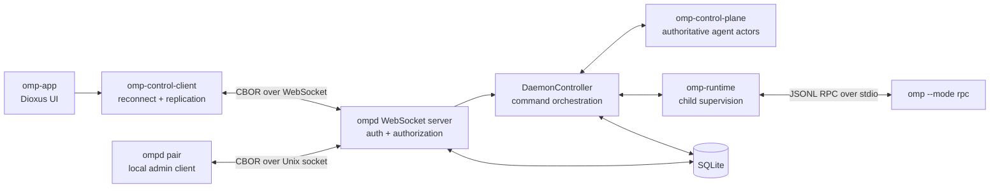
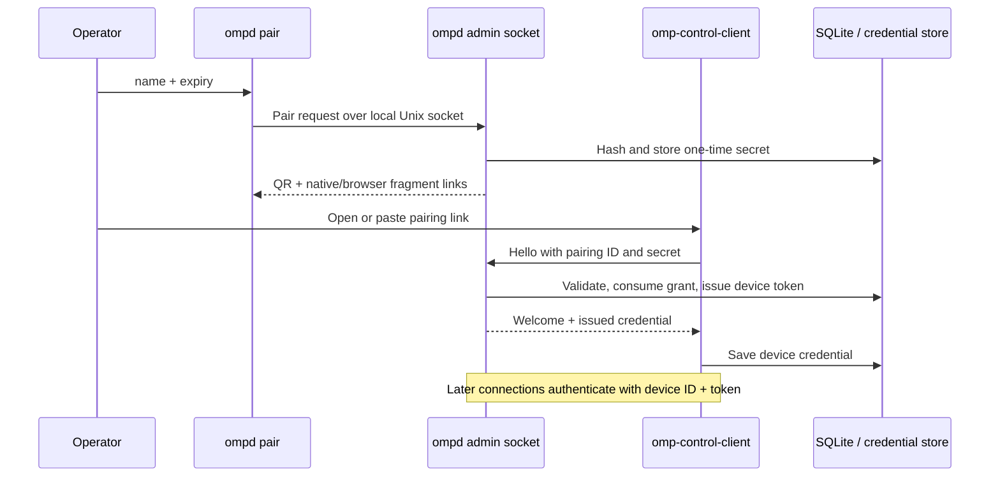

# Architecture

OMP Remote separates the public control protocol from OMP's process-local RPC protocol. `ompd` is the trust and ownership boundary: clients never talk directly to an OMP child process.

## System context

There are three important boundaries:

1. **Remote client to daemon:** authenticated, versioned CBOR frames over WebSocket.
2. **Daemon to OMP:** typed JSONL RPC over a supervised child's standard streams.
3. **Local operator to daemon:** owner-only Unix socket used to mint pairing grants.

## Crate responsibilities

### `omp-rpc`

Defines Rust types and framing for the OMP JSONL RPC protocol: commands, correlated responses, session events, messages, side-channel frames, subagents, and extension UI requests/responses. It has no process or network ownership.

### `omp-runtime`

Owns one `omp --mode rpc` child. Startup waits for the OMP ready frame and negotiates protocol capabilities when advertised. A runtime actor:

- Serializes commands to child stdin.
- Correlates responses by request ID.
- Decodes stdout incrementally with negotiated frame limits.
- Publishes events and prompt state.
- Captures stderr as runtime events.
- Applies startup, request, and shutdown timeouts.
- Kills the child if its owning runtime is dropped unexpectedly.

### `omp-control-protocol`

Defines protocol version 1 and its CBOR frames. It includes:

- Pairing and device-token authentication.
- Capability negotiation.
- Request/response envelopes.
- Agent snapshots, state deltas, events, and replay gaps.
- Subscriptions and resume cursors.
- Interaction leases and UI responses.
- Per-device scopes.

Mutating requests require an operation ID; read-only requests reject one. This distinction lets the daemon persist mutation outcomes and safely recognize retries.

### `omp-control-plane`

Provides the authoritative in-memory model. Each agent is owned by a Tokio actor, avoiding shared mutable state inside the lifecycle model. The actor maintains:

- Lifecycle, session, active/recent runs, available commands, and interaction state.
- Monotonic state revisions and event sequences.
- A bounded replay buffer for recent events.
- Bounded subscriber channels and resynchronization signals.
- Exclusive, expiring interaction leases.

`AgentRegistry` maps stable agent IDs to actor handles.

### `ompd`

Composes the system:

- `transport`: validates deployment modes and loads TLS 1.3 certificates.
- `server`: exposes `/control`, authenticates the first frame, authorizes every request, manages subscriptions, heartbeats, and bounded outbound queues.
- `controller`: maps control requests to control-plane transitions and runtime RPC calls.
- `persistence`: stores server identity, agents, session resume data, devices, pairing grants, and operation outcomes in SQLite.
- `admin`: exposes owner-only local pairing over a Unix socket.
- `pairing`: encodes one-time bundles into URL fragments and terminal QR codes.

### `omp-control-client`

Owns connection lifecycle independently of the UI. It supplies:

- Native and browser WebSocket adapters.
- Pairing and stored-credential authentication.
- Reconnection with bounded exponential backoff.
- Request correlation and operation IDs.
- Snapshot/delta reduction and subscription resume cursors.
- Native keyring and browser local-storage credential backends.

The UI receives high-level client events and reads replicated state; it does not parse protocol frames.

### `omp-app`

A shared Dioxus application for desktop, web, and declared mobile targets. `AppModel` projects replicated agent state and streamed RPC events into UI state. `AppActions` translates user intent into control requests. The view owns navigation, pairing, the live transcript, message controls, interaction dialogs, and device revocation.

## Connection and pairing flow

The database stores hashes of pairing secrets and device tokens, not their plaintext values. Secret wrapper types redact their debug output. Pairing grants expire and are consumed once.

The bundle also carries the server ID, public endpoint, and TLS identity hint. A publicly trusted deployment uses normal certificate validation; pinned self-signed mode includes a SHA-256 certificate fingerprint; plaintext is marked explicitly as development-only.

## Control request flow

For a typical prompt:

1. `omp-app` calls `AppActions::prompt`.
2. `omp-control-client` creates a correlated request with an operation ID.
3. `ompd` validates the envelope and checks the device's `prompt` scope.
4. Persistence claims the `(device_id, operation_id)` pair.
5. `DaemonController` marks a new run active in the agent actor and persists the agent state.
6. `omp-runtime` sends a typed prompt command to the OMP child and correlates its response.
7. The daemon persists the operation outcome before replying.
8. OMP session events flow through the runtime to the agent actor, then to subscribed clients as sequenced events.
9. The client reducer applies state snapshots/deltas; the app model renders transcript events.

A retry with the same operation and request returns the stored outcome. A conflicting request using the same operation ID is rejected. If the daemon restarts while an operation is pending, it marks that operation indeterminate rather than guessing whether the side effect happened.

## Subscription and replication model

Agent state and transcript events use separate monotonic counters:

- **State revision:** orders authoritative snapshots and deltas.
- **Event sequence:** orders streamed OMP events.

On subscribe, the control plane returns either a snapshot or a replay beginning after the client's cursor. A replay gap tells the client that its cursor is older than retained history; the client requests a fresh state snapshot rather than applying uncertain deltas. Slow subscribers are isolated by bounded queues and are told to resynchronize instead of blocking an agent actor indefinitely.

The client keeps resume cursors across reconnect attempts in memory. Durable history belongs to OMP session files; the current app transcript is a bounded live projection.

## Interaction leases

Extension UI requests may arrive at every subscribed client, but only one holder may answer. The app requests a lease containing a generated holder ID and a two-minute TTL. The daemon accepts a response only when:

- The device has the `answer_ui` scope.
- The lease belongs to that holder.
- The lease has not expired.

The app releases the lease after a successful answer. This prevents two phones or browser tabs from racing to respond to the same OMP prompt.

## Persistence and restart behavior

SQLite is initialized with foreign keys and a schema version. It stores:

| Data | Purpose |
| --- | --- |
| `metadata` | Stable server ID |
| `agents` | Lifecycle, process ID, active run, and timestamps |
| `sessions` | Session ID/file and replication cursors |
| `devices` | Descriptor, scopes, token hash, use/revocation timestamps |
| `pairing_secrets` | One-time secret hash, scopes, expiry, and consumption |
| `operations` | Idempotency claim, request hash, status, and encoded outcome |

At startup, persisted agents are restored into the registry. Agents left in starting, running, or stopping states are marked interrupted because child processes are not adopted across daemon restarts. Pending operations become indeterminate. This is intentionally conservative: the daemon does not claim a process or mutation survived when it cannot prove the outcome.

## Security boundaries

### Network transport

- Direct certificate and pinned-self-signed modes require `wss://`.
- Trusted reverse-proxy mode requires the daemon bind to the exact configured loopback address while advertising `wss://`.
- Development plaintext requires an exact loopback bind and `ws://`.
- Every public endpoint must end in `/control`.
- Direct TLS enables TLS 1.3 and HTTP/1.1 ALPN.

### Authentication and authorization

The first WebSocket frame must be a hello frame and must complete within the authentication timeout. Pairing exchanges the one-time secret for a long-lived device token. Every request is authorized against its specific scope:

| Scope | Requests |
| --- | --- |
| `observe` | List/get agents |
| `prompt` | Prompt, steer, follow-up |
| `mutate_session` | Launch agent, switch session |
| `stop_agent` | Stop agent, abort turn |
| `answer_ui` | Acquire/release lease and answer UI |
| `administer_devices` | List and revoke devices |

### Local administration

Pairing is not exposed as a remote control request. It is available only over a Unix socket whose mode is set to `0600`. The operator must also protect its containing directory and the SQLite database.

### Client storage

Native credentials use platform keyrings. Browser credentials use local storage because browser APIs do not expose an equivalent OS keyring; browser deployment security must therefore include origin integrity, browser profile access, and protection against script injection.

## Backpressure and limits

The design bounds channels and frame sizes at each asynchronous boundary. WebSocket authentication uses smaller pre-authentication frame limits; negotiated post-authentication limits apply afterward. Each connection has bounded control/event queues, heartbeat monitoring, and a slow-client timeout. Runtime RPC reads also enforce physical frame limits negotiated with OMP. These limits keep an unresponsive client or malformed peer from creating unbounded memory growth.
